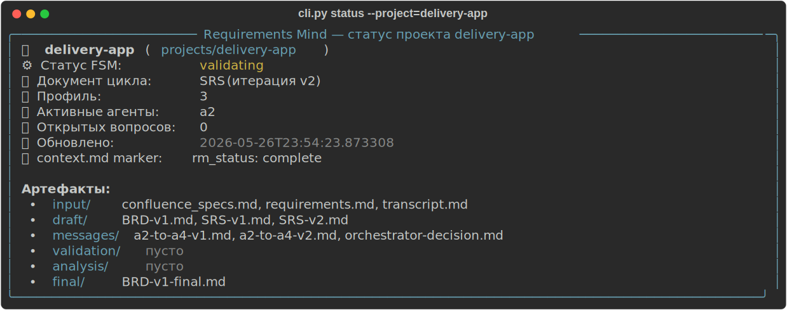
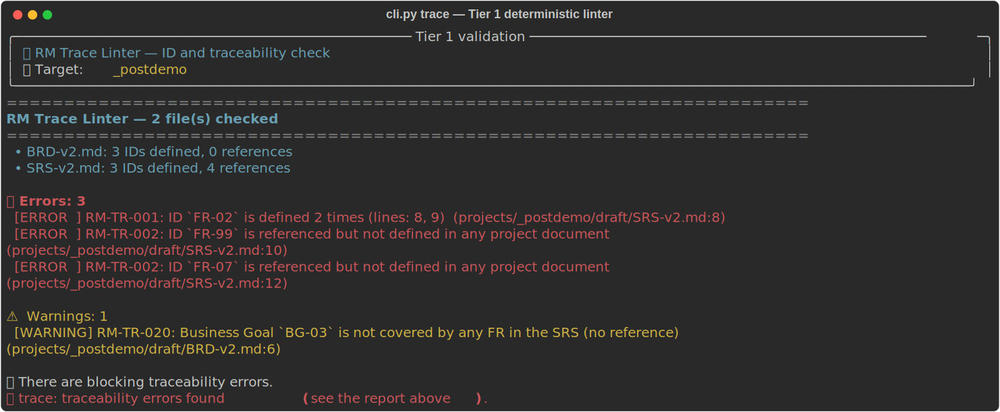

# Requirements Mind

**🇬🇧 English** | [🇷🇺 Русский](README.ru.md)

[](LICENSE)
[](https://www.python.org/downloads/)
[](tests/)
[](#)
[](#clipy-trace--tier-1-deterministic-id-validation)

**Requirements Mind** is a CLI-first, markdown-first, multi-agent tool for automating work with project requirements, drafting specifications, and conducting systems and business analysis on top of the **BMAD METHOD**.

The tool is designed **exclusively for requirements engineering** and is fully stripped of any classic software-development processes (writing code, sprints, developer tasks, Epics/Stories) inherited from the base BMAD method.

<p align="center">
  
  <br/>
  <em>The <code>cli.py status</code> command — a read-only overview of the project's FSM status and its artifacts.</em>
</p>

---

## 💡 The IDE-Native AI Agents Philosophy

Requirements Mind v2.0 is fully integrated with your development environment:
1. **The execution engine for the AI is your own IDE assistant** (Cursor, Claude Code, Antigravity). They already have access to the best language models and to your context. The AI agents run as local Markdown skills directly from the project folder.
2. **The CLI tool (`cli.py`) acts as a Pure State & File Controller.** It needs no API keys, runs locally, validates state transitions in `state.json`, and syncs the project with Obsidian and NotebookLM.
3. **A cumulative source of truth (Cumulative Context Pattern):** the context file `context.md` is the backbone of the project. It is protected from being overwritten from scratch and from compression. As the chain BRD ➡️ SRS ➡️ Tech Design progresses, the AI agents carefully weave new Use Cases, entities, database structures, and APIs into the corresponding sections, automatically keeping a change log in a separate `context-changelog.md` next to it.

---

## 📋 The 6 Target Requirement Project Profiles

When initializing a project, the system helps you pick one of **6 specialized requirement profiles**, depending on the goals and scale of your project:

1. **Profile 1: "Business Concept"** (goal: conceptual business requirements — **BRD**).
2. **Profile 2: "System Specification"** (goal: detailed system requirements and logic — **BRD ➡️ SRS**).
3. **Profile 3: "Architecture Design"** (goal: architectural flows and database structure — **BRD ➡️ SRS ➡️ Tech Design**).
4. **Profile 4: "Integration & API"** (goal: the full design cycle, including REST/gRPC contracts — **BRD ➡️ SRS ➡️ Tech Design ➡️ API Contract**).
5. **Profile 5: "Analytical Research (Mode B)"** (goal: free-form requirements analysis, document comparisons in the **`analysis/`** folder).
6. **Profile 6: "Requirements Elicitation" (Elicitation Mode)** (goal: interactive requirements gathering from scratch via an AI interview in chat, when the analyst has only an idea and no raw inputs).

---

## 💬 The "Requirements Elicitation" Mode (Elicitation Mode)

The from-scratch elicitation mode (Profile 6) is built to solve the "blank page" problem. If you have only a raw project idea, the AI interviewer holds a deep dialogue with you using the hybrid **"Pragmatic Analyst"** methodology:

* **Business value and JTBD (Jobs-to-be-Done):** surfacing the key problems, users, their motivations, and the ultimate business value via the formula *"When I…, I want to…, so that…"*.
* **Boundaries and scenarios (Use Cases):** describing user roles, their interactions with the system, and the functional building blocks.
* **System requirements (NFRs per ISO/IEC/IEEE 29148):** surfacing critical non-functional requirements (performance, scalability, security, reliability, integration).

When the dialogue ends, the AI interviewer **automatically** generates and saves to disk the file **`projects/<project-name>/input/requirements.md`**, which becomes a full-fledged foundation for the document chain (BRD, SRS, etc.).

---

## 🗣️ Unique AI Command Codes (Capabilities Menu) in the IDE chat

So that you don't have to type long prompts to your IDE assistant by hand, we have fully remapped the BMAD agent menu (Mary, John, Paige) onto **unique, non-overlapping, requirements-oriented codes.**

> [!IMPORTANT]
> All standard BMAD software codes (such as `DP`, `BP`, `MR`, `DR`, `TR`, `CB`, `WB`, etc.) are **fully blocked and muted** to prevent AI models in Cursor or Claude Code from hallucinating. Use exclusively the new unique `RM...` codes:

| Command code | Skill name | What the AI agent does |
| :---: | :--- | :--- |
| **`RMONB`** | **Project onboarding** (`a0-onboarding-wizard`) | Runs Project Discovery, surveys you across the 6 requirement profiles, and produces a step-by-step Roadmap. |
| **`RME`** | **Requirements elicitation from scratch** (`a3-elicitation`) | Conducts a Socratic interview using the "Pragmatic Analyst" methodology and creates `requirements.md`. |
| **`RMIN`** | **Intake analysis of raw data** (`a1-intake-analyst`) | Analyzes files in `input/`, removes noise, and creates a structured `context.md` (with no data compression). |
| **`RMQ`** | **Clarifying-question generation** (`a3-question-generator`) | Runs an interactive survey right in the IDE chat (with free-text answers supported) to close context gaps. |
| **`RMDW`** | **Draft writing** (`a4-document-writer`) | Generates the first draft of a specification (BRD, SRS, Tech Design, API) strictly following the `kb/` checklists. |
| **`RMVAL`** | **Strict validation** (`a2-requirements-validator`) | Checks the draft's quality for edge cases and completeness, and produces a report with a `PASSED`/`FAILED` verdict. |
| **`RMAN`** | **Analytical research** (`a6-analysis-writer`) | Performs free-form analysis (risks, contradictions, document comparison) into the `analysis/` folder. |
| **`RMAUG`** | **Augmenting an existing document** (Augment Mode) | Carefully enriches an existing SRS/BRD/Tech-Design with new artifacts, **preserving the structure and wording** of the baseline. A diff plan in chat and user confirmation are mandatory before writing. Details: [`docs/walkthroughs/augment-dams-srs.md`](docs/walkthroughs/augment-dams-srs.md). |
| **`reqmind`** | **Control menu** (`reqmind`) | The interactive Requirements Mind navigator. Lists all RM codes, CLI commands, and scenarios. |

> [!TIP]
> **The super-command `/reqmind`:** type **`/reqmind`** in your IDE chat (in Claude Code / Antigravity) or mention **`@reqmind`** (in Cursor), and the AI assistant will instantly print an interactive Capabilities Menu with all available agents, CLI commands, and workflows! You can also use and run any RM codes individually.

### 🗣️ How to enter commands in the IDE chat (3 formats)

The Requirements Mind AI agents are very flexible and recognize commands in whatever format is convenient for you:
1. **As a regular word in a sentence (Recommended):** the AI will automatically extract the unique code from your text request.
   * *"Hi Mary! Run RME for a new project delivery-app"*
   * *"John, do RMDW for project my-app, I need an SRS draft"*
2. **As a short "shotgun command":** just send the code and the project name to the chat:
   * `RMONB my-project`
   * `RME delivery-app`
3. **Via a slash (`/`):** if you are used to slash interfaces:
   * `/RMONB my-project`
   * `/RMIN my-project`

---

### 🔍 How to integrate RM codes into your IDE's `/` and `@` dropdown menus

Since different IDEs are built differently, the options for customizing the slash (`/`) dropdown vary:

#### 1. In the Cursor IDE (via the `@` At-Mentions mechanism)
In Cursor, the `/` dropdown (which lists `/ask`, `/edit`, `/code`, etc.) is hard-wired into the IDE's own source code, and at present Cursor offers no open API for adding custom commands to that particular menu.

**But Cursor has a far more powerful native tool — the `@` (At-Mentions) menu:**
* Type the **`@`** character in the chat box and start typing a skill name, for example: **`@a0-onboarding-wizard`** or **`@a3-elicitation`**.
* Cursor will show a hint and let you attach the skill file directly to your message.
* After that, write any text (e.g., *"Run for my-app"*), and the AI will instantly apply that skill to the dialogue with 100% accuracy!

#### 2. In Google Antigravity SDK and Claude Code (Automatically)
In these environments, the `/` dropdown is built dynamically from the skills' metadata.
Since our `install.py` installer copied all the skill md-files with YAML headers into the `.agent/skills/` and `.claude/skills/` folders, the AI assistants **automatically register** them in their internal command list. When you type `/`, they show up in the dropdown with our descriptions!

#### 3. In the OpenAI Codex CLI (Terminal directives)
The auto-installer copies all skills into the `.codex/skills/` folder. You can invoke agents straight from the terminal:
```bash
codex --model=gpt-4o --prompt="@AGENTS.md @.cursorrules Run RMONB for project <name>"
```
*It is important to explicitly reference the files `@AGENTS.md` and `@.cursorrules` in your prompt to give the agent the full context of the team rules and the Capabilities Menu.*

---

## ⚙️ Quick Start

### 1. Set up the environment from scratch in 1 command
To deploy and configure Requirements Mind from scratch in any folder on your machine, run a single command in the terminal — pick the block for your OS:

<details open>
<summary><b>🍎 macOS / 🐧 Linux (Bash / Zsh)</b></summary>

```bash
curl -fsSL https://raw.githubusercontent.com/Menta1ik/requirements-mind/main/install.py -o install.py && python3 install.py
```

</details>

<details>
<summary><b>🪟 Windows (PowerShell)</b></summary>

```powershell
Invoke-WebRequest -Uri https://raw.githubusercontent.com/Menta1ik/requirements-mind/main/install.py -OutFile install.py; python install.py
```

> **Requires:** Python 3.10+ (`python --version`), Git, and PowerShell 5.1+ (built into Windows 10/11).
> If `python` is not found — install Python from [python.org](https://www.python.org/downloads/) and check the **"Add Python to PATH"** box.

</details>

*This command automatically downloads the installer, fetches the core distribution from GitHub, sets up a Python virtual environment, installs all dependencies, links the AI skills to your chosen IDEs, and prepares a visual Obsidian Vault with a demo project. The installer detects the OS itself and substitutes the correct venv paths (`bin/` for Unix, `Scripts/` for Windows).*

### 2. Autonomous import from Web/Confluence in 1 click (New!)
If your source materials or requirements live in a closed corporate Confluence, Jira, or a web page you can access in your browser:

1. **Launch Chrome with a debugging port** — pick the block for your OS:

   <details open>
   <summary><b>🍎 macOS</b></summary>

   ```bash
   open -a "Google Chrome" --args --remote-debugging-port=9222
   ```

   </details>

   <details>
   <summary><b>🐧 Linux</b></summary>

   ```bash
   google-chrome --remote-debugging-port=9222
   # or: chromium --remote-debugging-port=9222
   ```

   </details>

   <details>
   <summary><b>🪟 Windows (PowerShell)</b></summary>

   ```powershell
   Start-Process "chrome.exe" -ArgumentList "--remote-debugging-port=9222"
   ```

   > If `chrome.exe` is not on your PATH — specify the full path, for example:
   > `Start-Process "C:\Program Files\Google\Chrome\Application\chrome.exe" -ArgumentList "--remote-debugging-port=9222"`

   </details>

   *(And open the tab with the Confluence article you need.)*
2. **Ask the AI agent in the IDE chat:**
   > **"Mary, import the requirements from the Confluence tab for project my-project"**
3. **The AI agent will itself propose and run the import command:**
   ```bash
   uv run cli.py import-web --project=my-project --port=9222 --query="confluence" --filename="confluence_specs.md"
   ```
   *(You just need to press the confirm-run button in the IDE chat. The script connects to Chrome over CDP itself, downloads the article, converts it to Markdown, and saves it into `input/`.)*

> [!NOTE]
> **Performance and portability (CDP connection):**
> Thanks to the CDP (Chrome DevTools Protocol), the import script connects to your **already running browser**. This means **installing the heavy Playwright browser binaries (`playwright install`) is NOT required**. We use your own Chrome, its cookies, and your active session, which makes the setup instant and the operation safe.


### 3. A full pipeline example (Requirements from scratch)
Requirements development is fully automated and runs right through your dialogue with the AI in your IDE. All the necessary CLI commands are proposed and run by the AI agent automatically:

1. **Interview and initialization (RME):**
   * Write to Mary in the chat: **`"Run RME for a new project my-delivery-app"`**.
   * The AI agent **creates the folder structure itself**, generates `state.json`, runs the "Pragmatic Analyst" interview with you, and records the requirements into `input/requirements.md` and `context.md`.
   * The AI agent automatically proposes running the onboarding:
     ```bash
     # RUN AUTOMATICALLY BY THE AI AGENT AFTER CONFIRMATION IN CHAT
     uv run cli.py onboard --project=my-delivery-app
     ```
2. **Requirements analysis and gap closing (RMIN):**
   * Write to the AI agent: **`"Run RMIN for my-delivery-app"`**.
   * The AI analyzes the context for completeness. If gaps are found, it runs a survey with free-text answers enabled.
   * Once the gaps are closed, the AI agent automatically proposes running the intake-commit command (Intake):
     ```bash
     # RUN AUTOMATICALLY BY THE AI AGENT AFTER CONFIRMATION IN CHAT
     uv run cli.py intake --project=my-delivery-app
     ```
3. **Specification draft generation (RMDW):**
   * Write to the AI agent: **`"Run RMDW for my-delivery-app, I need a BRD draft"`**.
   * The AI creates the draft document `BRD-v1.md` in the `draft/` folder, strictly following the `kb/` knowledge-base checklists.
   * The AI agent automatically proposes committing the draft:
     ```bash
     # RUN AUTOMATICALLY BY THE AI AGENT AFTER CONFIRMATION IN CHAT
     uv run cli.py draft --project=my-delivery-app --doc=BRD
     ```
4. **Strict quality control (RMVAL + Tier 1 trace):**
   * Before running the LLM validator, it is recommended to run the cheap deterministic form check — the ID and traceability linter:
     ```bash
     uv run cli.py trace --project=my-delivery-app
     ```
     It catches duplicate `FR-01`s, orphan references (an ID is mentioned but defined nowhere), and Business Goals with no FR coverage in the SRS — in milliseconds, with no LLM. Suitable for pre-commit / CI.
   * After that, run the semantic LLM validation: **`"Run RMVAL for my-delivery-app"`**.
   * The A2 AI agent checks the draft for logical inconsistencies, edge cases, and missing details, and produces a report with a `PASSED`/`FAILED` verdict.
   * The AI agent automatically proposes committing the validation results:
     ```bash
     # RUN AUTOMATICALLY BY THE AI AGENT AFTER CONFIRMATION IN CHAT
     uv run cli.py validate --project=my-delivery-app --doc=BRD --version=1
     ```
5. **Finalization and moving to the next stage (Final):**
   * If validation passes (`PASSED`), the AI agent automatically proposes finalizing the document:
     ```bash
     # RUN AUTOMATICALLY BY THE AI AGENT AFTER CONFIRMATION IN CHAT
     uv run cli.py final --project=my-delivery-app --doc=BRD --version=1
     ```
   * The document is copied into `final/`, and the project moves on to the system-specification design stage (`SRS`).

---

## 🔄 Updating

To update the Requirements Mind core, its dependencies, and the AI skills across all your development environments (Cursor, Claude Code, Antigravity, OpenAI Codex) to the latest version from GitHub, run a single command in the terminal — it is the same on every OS:

```bash
uv run cli.py update
```

> **If you don't have `uv` installed** — use the Python from your venv directly:
>
> <details>
> <summary><b>🍎 macOS / 🐧 Linux</b></summary>
>
> ```bash
> .venv/bin/python cli.py update
> ```
>
> </details>
>
> <details>
> <summary><b>🪟 Windows (PowerShell)</b></summary>
>
> ```powershell
> .\.venv\Scripts\python.exe cli.py update
> ```
>
> </details>

**What the command does:**

1. **Core file update:**
   * If the project is a Git repository → it runs `git pull origin main`.
   * If the project was deployed from a ZIP archive → it downloads a fresh ZIP from GitHub and carefully updates only the core files: `cli.py`, `install.py`, `requirements.txt`, `skills/`, `kb/`, `docs/`, `flows/`, `scripts/`.
2. **Dependency update:** new libraries from `requirements.txt` are checked and installed (via `uv` or `pip`).
3. **IDE AI-skill update:** `setup-ide` is automatically re-run, copying the fresh skills and `.cursorrules` into all your AI assistants (Cursor, Claude Code, Google Antigravity, OpenAI Codex).

> [!IMPORTANT]
> **What is guaranteed NOT to be touched during an update:**
> * `projects/` — all your working projects;
> * `.env` and `.env.local` — your local settings;
> * `vault/` and `notebooklm/` — generated bases and exports;
> * any customizations of yours outside the core file list.

📖 A full description of the update process and recovery scenarios is in [`docs/user_guide.md` §5](docs/user_guide.md#5-automatic-requirements-mind-update-one-click-update).

---

## 🗂 Project structure

```
requirements-mind/
├── cli.py                  # The main FSM CLI controller (argparse + Pydantic + rich)
├── install.py              # Bootstrap installer (Python, venv, IDE integration, demo)
├── pyproject.toml          # Package metadata and dev dependencies (pytest)
├── requirements.txt        # Runtime dependencies (5 packages, no LLM SDK)
├── LICENSE                 # MIT
│
├── skills/
│   ├── rm/                 # Requirements Mind AI skills (a0…a6, master-orchestrator, reqmind)
│   ├── bmad/               # Base BMAD skills (party-mode, validate, edge-case-hunter, …)
│   └── custom/             # TOML overrides for BMAD-agent customizations
│
├── kb/                     # Reference checklists (BRD/SRS/Tech Design/API Contract) + glossary
├── flows/                  # Pipeline-stage descriptions for the agents (00-onboarding…09-elicitation)
│
├── projects/<name>/        # The working folder of a single project (created by the CLI)
│   ├── state.json          # FSM state (the source of truth for cli.py)
│   ├── context.md          # Cumulative context with rm_status frontmatter
│   ├── context-changelog.md
│   ├── input/              # Raw materials (transcripts, tickets, Web imports)
│   ├── draft/              # Specification drafts by version (BRD-v1.md, SRS-v2.md, …)
│   ├── messages/           # Validation reports with rm_verdict frontmatter
│   ├── validation/         # Validation log files
│   ├── analysis/           # Free-form analysis (Mode B)
│   └── final/              # Finalized, approved documents
│
├── scripts/                # Utilities: import_web (CDP), sync_to_vault, export_to_notebooklm
├── tests/                  # pytest suite: FSM, frontmatter, sanitize, reset
├── docs/                   # user_guide.md, specification_v2.md, walkthroughs/ (detailed cases), screenshots/
├── vault/                  # Generated Obsidian Vault (in .gitignore)
└── notebooklm/             # Exports for Google NotebookLM (in .gitignore)
```

---

## 🩺 Diagnostics and manual FSM control

If the AI agent's automation fails (it didn't hear the RM code, formed the artifact incorrectly, or the IDE refused to run the CLI), you have two fully manual commands for debugging and rollback.

### `cli.py status` — what is happening with the project right now

```bash
uv run cli.py status --project=my-app
```

A read-only overview: the current FSM status, the document/iteration, active agents, open questions, the `rm_status` marker in `context.md`, and a summary of artifacts across all six project subdirectories. It writes nothing and is safe to call at any time.

### `cli.py reset` — force an FSM transition

```bash
# With confirmation in a TTY
uv run cli.py reset --project=my-app --to=intake

# Without confirmation (for scripts)
uv run cli.py reset --project=my-app --to=drafting --yes
```

Allowed `--to` values: `onboarding | intake | needs_questions | drafting | validating | needs_revision | approved`. The command edits **only** `state.json` and automatically sets `active_agents` for the target status. On-disk artifacts (`draft/`, `messages/`, `final/`) are not touched.

### `cli.py trace` — Tier 1 deterministic ID validation

<p align="center">
  
  <br/>
  <em>The <code>cli.py trace</code> command — a deterministic regex ID linter. It catches duplicates (RM-TR-001), orphan references (RM-TR-002), and uncovered Business Goals (RM-TR-020) in milliseconds, with no LLM.</em>
</p>

```bash
# The whole project
uv run cli.py trace --project=my-app

# A single document at a specific version
uv run cli.py trace --project=my-app --doc=SRS --version=1

# An arbitrary .md file (outside the project structure)
uv run cli.py trace --file=path/to/SRS-v1.md
```

A regex linter with no LLM. It **complements** `RMVAL` (the A2 semantic LLM validator), not replaces it:

| Tier | Who checks | What it catches |
| :---: | :--- | :--- |
| **Tier 1** — `cli.py trace` | regex, milliseconds | Duplicate `FR-01`s within one document, orphan references (an ID is mentioned but defined nowhere), Business Goals from the BRD with no FR coverage in the SRS, ID form (`FR-01`, `FR-REG-01`, `NFR-CAP-02`, `BG-1`) |
| **Tier 2** — `RMVAL` / `cli.py validate` | A2 (LLM), seconds-to-minutes | Semantics: are the NFRs measurable, are there alternatives in the Use Case, is the SRS consistent with the BRD, are there any shallow wordings |

**Exit codes** are machine-readable (`0` — clean, `1` — errors present, `2` — invocation error) — it plugs into a pre-commit hook or CI with no wrapper. **It does not touch `state.json`** — it is a pure check, not an FSM transition.

The canonical ID alphabet: 2-5 uppercase letters + 0-3 subdomains + 1-4 digits. Examples from the "green" zone: `FR-01`, `FR-REG-01`, `NFR-CAP-02`, `UC-REG-AS-1`, `VAL-03`. Won't pass: `fr-01` (lowercase), `FR_01` (underscore), `FR-01234567` (tail >4 digits — warning `RM-TR-010`).

---

## ⚠️ Limitations and known risks

Requirements Mind is "a deterministic CLI controller on top of non-deterministic AI agents". To avoid inflated expectations, the boundaries of the current version's capabilities are listed honestly below.

### IDE support

| IDE                          | Support level             | What works / what doesn't                                                                                                                  |
| :---                         | :---                      | :---                                                                                                                                       |
| **Claude Code**              | ✅ Tested                  | Slash commands (`/RMONB`, `/reqmind`, …) are picked up from `.claude/skills/`. CLI auto-run requires confirmation in chat.               |
| **Cursor**                   | ✅ Tested                  | The `/` menu is not natively extensible (a closed part of Cursor), but the `@` menu sees skills from `.agents/skills/`. RM codes are recognized in free text. |
| **Google Antigravity**       | 🟡 Best-effort             | Skill pickup from `.agent/skills/` is expected to follow the same rules as Claude Code, but end-to-end scenarios are tested case by case.   |
| **OpenAI Codex CLI**         | 🟡 Best-effort             | Skills are copied into `.codex/skills/`. An explicit mention of `@AGENTS.md @.cursorrules` is required in each prompt for reproducible behavior. |

### What the tool does not guarantee

1. **The AI agent may "not hear" an RM code.** Especially with short requests, a very long chat history, or competing instructions from the IDE's system prompt. **What to do:** repeat the command in an explicit format — `RMIN <project-name>` as a separate message, or run the CLI stage manually (see below).
2. **The AI may form `context.md` / a validation report incorrectly.** In particular — it may forget the control frontmatter (`rm_status`, `rm_verdict`). The CLI **will not break**: for those cases there is a legacy substring fallback that prints a warning and asks the agent to add frontmatter. But the FSM decision in this mode is less reliable — double-check it.
3. **CLI auto-run from chat is not magic.** The AI agent *proposes* a command, but actually executing it in your IDE's terminal is the IDE's own feature (Cursor Composer, Claude Code shell calls, etc.). If it is unavailable in your environment, copy and run the command manually.
4. **Concurrent work by two analysts on one project is not supported.** `state.json` is edited without locks. For collaboration, use Git and do not run `cli.py` in parallel on the same project folder.
5. **`projects/<name>/` is not the source of truth.** It is one analyst's working folder. The permanent store is Git and/or the Obsidian Vault.

### Emergency manual mode (if the automation goes silent)

Any pipeline stage can be run manually via the CLI, bypassing the chat:

```bash
uv run cli.py intake   --project=my-app
uv run cli.py draft    --project=my-app --doc=BRD
uv run cli.py validate --project=my-app --doc=BRD --version=1
uv run cli.py final    --project=my-app --doc=BRD --version=1
```

To debug a stuck FSM, see the [«Diagnostics and manual FSM control»](#-diagnostics-and-manual-fsm-control) section — it describes the `status` and `reset` commands.

### Tests

The CLI is covered by a pytest suite (`tests/`): the intake/validate FSM transitions (including both frontmatter branches and the fallback), the frontmatter parser, project-name sanitization, and `reset` behavior. To run:

```bash
uv run pytest
```

The coverage is specifically the state-controller layer (what can actually break when editing `cli.py`). The behavior of the AI agents themselves is not covered by pytest — that is a matter of the model and the IDE context, not of our code.

---

## 📘 Further reading
* [Detailed user guide](docs/user_guide.md) — a detailed description of every step, plus Obsidian and NotebookLM setup.
* [Walkthroughs — detailed cases](docs/walkthroughs/README.md) — step-by-step breakdowns of real cases with prompts, commands, and expected artifacts. They complement the user guide where the formal description is not enough.
* [The Agents description (AGENTS.md)](AGENTS.md) — a description of the virtual AI team's roles.
